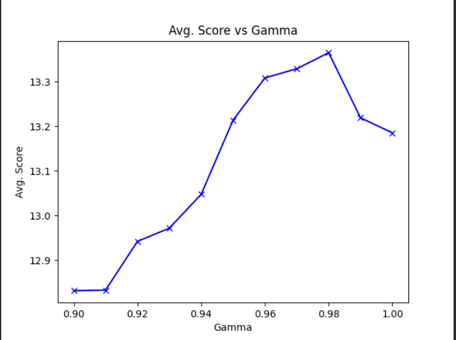
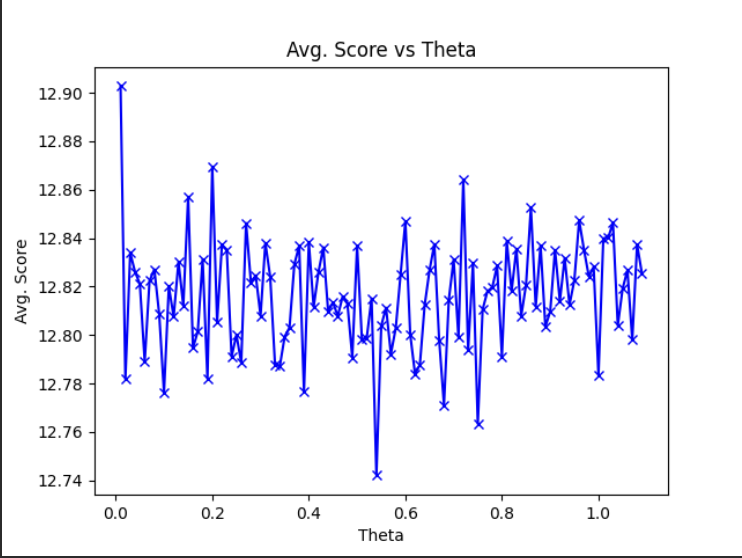

# Solution for Dice Game Using Value Iteration

## Abstract

This project focuses on solving a variant of a dice game by constructing an agent that utilizes the value iteration 
algorithm and a one-step look ahead heuristic. The agent aims to maximize its score by choosing the best action based 
on the expected rewards.

## Introduction
### Game
The dice game begins with a score of 0 and involves rolling three fair, six-sided dice. This is the case for standard 
play. User can change the dynamics (e.g. number of dice, probabilities etc.). The player has two options after each 
roll: stick with the current values or pay 1 point to reroll. If the player chooses to stick and two or more dice show 
the same value, the total is added to their score. The objective is to maximize the final score.

### Objectives
The main goal of this project is to develop an agent that can effectively choose actions to maximize the final score in 
the dice game. The agent uses the value iteration algorithm and one-step look ahead heuristic to determine the best 
actions based on expected rewards.

## Method
The value iteration algorithm is employed to find the optimal policy for each state in the dice game. The algorithm 
calculates the expected rewards by considering the current state and available actions. The expected utility of a state
is the sum of the immediate reward and the discounted expected utility of the next state.

### Process
The agent initializes a dictionary called "state_dict" that stores the expected rewards and optimal actions 
for each state. Initially, the expected rewards for all states are set to zero and all actions set to empty tuples. In 
addition, it initializes a dictionary called "memoization_table" that stores the future action-state pairs in order to
optimize one-step look ahead heuristic.

The agent iterates over the states until the expected rewards converge. For each state, it evaluates the available 
actions and calculates the expected rewards for each action using a one-step look ahead. The expected rewards are 
updated based on the Bellman update equation, which incorporates the immediate rewards and the expected rewards of the 
subsequent states.

The iteration continues until the change in expected rewards falls below a predefined threshold (THETA). Once the
expected rewards have converged, the game begins. For each roll of the dice, the agent looks up the current state in
"state_dict" to determine the optimal action to take.

## Parameter Optimization
Two parameters need to be determined: the discount rate (GAMMA) and the convergence threshold (THETA). The agent's 
performance is evaluated by testing different combinations of these parameters over a large number of games. The 
parameter values that result in higher scores are selected as the optimal choices.

Parameter optimization tests gamma and theta separately for their default values 0.9 and 0.01 respectively. It tests for
10000 random cases for each value.

When the plots considered, it is seen that the optimal value for gamma is 0.98 and theta is 0.01. But having theta
smaller increases the operation time. Since there is no dramatic change in the avg. score, it is best to take second
optimal value which is 0.7.

### Usage
In order to test and plot the gamma-theta optimal values, user runs the "parameter_optimization.py". Code will call the
"MyAgent" class and test the values for the decided range.

## Implementation
The MyAgent class represents the agent in the dice game. It extends the DiceGameAgent class, which provides the basic 
rules and functionality for the game.

During initialization, the agent performs the value iteration algorithm to calculate the expected rewards for each state 
and determine the optimal policies. It maintains a memoization table to cache the next states' information for 
efficiency.

The play method of the agent takes a state as input and returns the chosen action for that state. It looks up the state 
in the state_dict dictionary to retrieve the optimal action.

## Conclusion
The value iteration algorithm, combined with the one-step look ahead heuristic, enables the agent to make optimal 
decisions in the dice game. By considering the expected rewards for each state and selecting the action with the highest 
expected value, the agent maximizes its final score. The parameter optimization process helps in finding the optimal 
values for the discount rate and the convergence threshold, further enhancing the agent's performance.